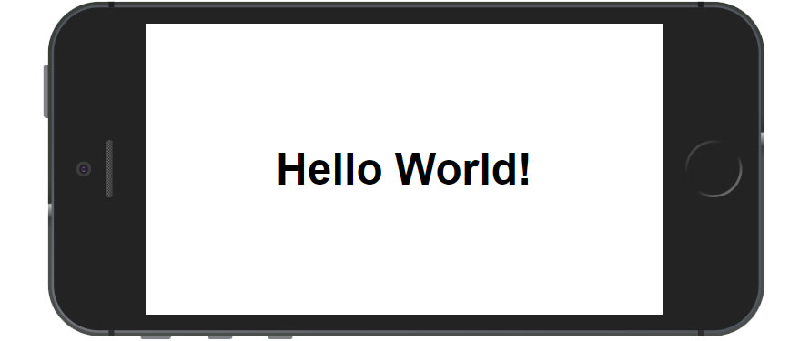

# HomeCare PWA
A custom Progressive Web App for our family HomeCare

## What It Is

A simple PWA utilizing an app manifest, service workers and caching. This demo is written in plain-vanilla HTML, CSS and Javascript (ES6). It has no dependencies.

Based off a tutorial on Medium:

https://medium.com/james-johnson/a-simple-progressive-web-app-tutorial-f9708e5f2605

## Demo

https://clearlynow.github.io/HomeCare/

## Browser Compatibility

Hello PWA has been tested in the following browsers:

* Chrome 67 (Windows and Android)
* Firefox 60
* Safari 11
* Edge 42
